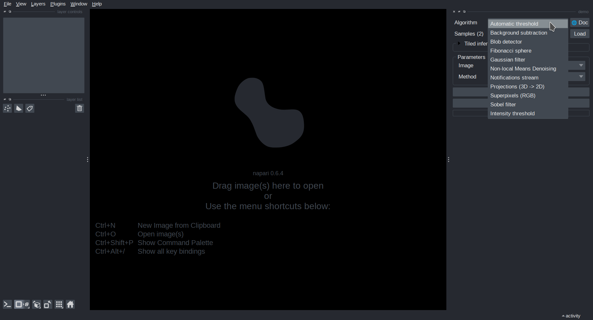
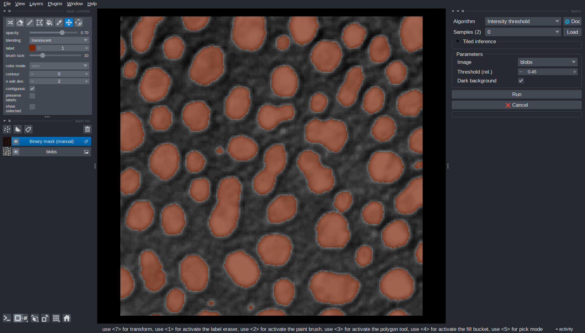
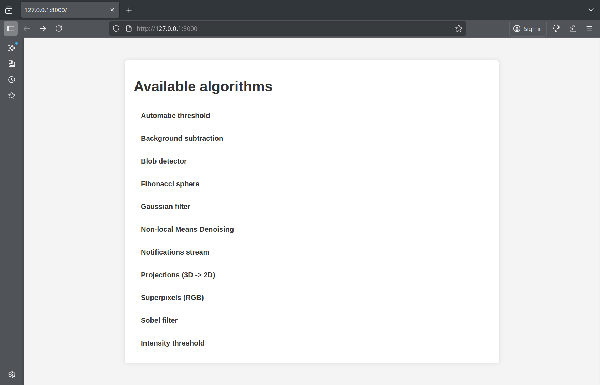

# Try the demos

The package comes with a set of demo algorithms. Running them is the quickest way to get a feel for what *Imaging Server Kit* does before writing any code.

!!! note
    The demos below use Napari. Install it with `pip install "imaging-server-kit[napari]"` (see [Installation](installation.md)).

## Napari demo

From a terminal, run:

```sh
serverkit demo napari
```

This opens a **Napari viewer** with the *Imaging Server Kit* plugin already loaded. The *Algorithm* dropdown lists the demo algorithms.



When you select an **algorithm**, the *Parameters* panel updates to show the tunable **parameters** of that algorithm.

Most algorithms need an input image. You can **load a sample image** by selecting it in the *Samples* dropdown and clicking *Load*. Once an image is loaded, you can run the algorithm and look at the results.



Some algorithms re-run automatically when you change a parameter. For example, *Intensity threshold* updates its output as soon as you adjust the threshold value.

!!! tip "Algorithm documentation"
    Click the **🌐 Doc** button to open the **documentation page** of an algorithm in a web browser.

## Server demo

To see how algorithms can be served over HTTP, start the demo server:

```sh
serverkit demo serve
```

This starts a web server on your machine at http://localhost:8000. If you open this address in a browser, you will see an overview of the algorithms available on the server.



### Connecting from Napari

While the server is running, open another terminal and run:

```sh
napari -w imaging-server-kit
```

This is equivalent to opening `Plugins > Imaging Server Kit > Connect to server` in Napari.

In the plugin panel, enter the server address (http://localhost:8000) and press *Connect*. The *Algorithm* dropdown fills with the algorithms available on the server, which you can use just like in the local demo.

<video width="640" controls loop autoplay muted playsinline>
  <source src="../assets/videos/server_napari.mp4" type="video/mp4">
</video>

!!! note
    In this demo, the client and the server run on the same machine. The server could just as well run on another machine of your network, such as a workstation or a cluster node (see [Serve an algorithm](../how-to/deploy-server.md)).

### Connecting from QuPath

Algorithm servers can also be used from QuPath, for segmentation and object detection tasks. See [Usage with QuPath](../how-to/qupath.md) for a walkthrough with the demo server.

## Next steps

Learn how to [create your own algorithm](../tutorial/create-algorithm.md), so that it can be served and used in Napari just like the demos.
