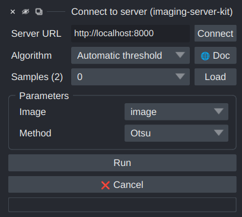

# Usage with Napari

*Imaging Server Kit* can generate [Napari](https://napari.org/stable/) dock widgets for algorithms, algorithm collections, and algorithm servers.

!!! note
    Install the Napari extra first: `pip install "imaging-server-kit[napari]"`.

## Opening a widget

### From the Napari plugin menu

The *Imaging Server Kit* plugin adds a few entries to the `Plugins > Imaging Server Kit` menu:

|   |   |
|---|---|
| *Connect to server* | A widget that connects to an [algorithm server](../tutorial/serve.md) |
| *Demo algorithms* | The demo algorithms (same as `serverkit demo napari`) |
| *Tool algorithms* | The [built-in algorithms](combine.md#built-in-algorithms) (same as `serverkit tools napari`) |
| *Connect to QuPath* | The [QuPath bridge](qupath.md) |

To start Napari with the *Connect to server* widget already open, run:

```sh
napari -w imaging-server-kit
```

### From Python

You can pass an algorithm, an algorithm collection, or a client to `sk.to_napari`. This will add the widget to a new viewer and return that viewer:

```python
import imaging_server_kit as sk

viewer = sk.to_napari(my_algo)
```

To add the widget to an existing viewer instead, pass it with `viewer=`:

```python
import napari

viewer = napari.Viewer()
sk.to_napari(my_algo, viewer=viewer)
```

!!! tip
    Calling `napari.run()` is needed in Python scripts to keep the viewer open (but not in Jupyter notebooks or IPython).

## Widget overview



From top to bottom, the widget contains:

- **Server URL**: the address of the algorithm server (used when connecting to a server).
- **Algorithm**: a dropdown to select the algorithm (and access its `🌐 Doc` page).
- **Samples**: a dropdown to select and load samples into the viewer (only visible when there are samples).
- **Parameters**: one input field per parameter, generated from the [parameter annotations](../tutorial/create-algorithm.md#annotating-parameters).
- **Tiled inference** (when the algo has set `tileable=True`): [run the algorithm tile-by-tile](tiling.md).
- **Run** and **❌ Cancel**, and a progress bar.

### Parameter fields

| Parameter layer | Field |
|---|---|
| `sk.Integer`, `sk.Float` | Spin box, using `min`, `max`, `step`, and `default` |
| `sk.Bool` | Checkbox |
| `sk.Choice` | Dropdown of the `items` |
| `sk.String` | Text field |
| `sk.Image`, `sk.Mask`, `sk.Points`, `sk.Boxes`, `sk.Vectors`, `sk.Paths`, `sk.Tracks` | Dropdown of the matching layers in the viewer |
| `sk.Any`, `sk.Null` | Not shown |

The `name` of a parameter is used as its label, and its `description` is shown as a tooltip.

When a parameter has `auto_call=True`, changing its value re-runs the algorithm.

<video width="512" controls loop autoplay muted playsinline>
  <source src="../assets/videos/auto_call.mp4" type="video/mp4">
</video>

## Results in the viewer

Each output layer is shown in the viewer according to its type:

| Output layer | Shown as |
|---|---|
| `sk.Image` | `Image` layer |
| `sk.Mask` | `Labels` layer |
| `sk.Points` | `Points` layer |
| `sk.Boxes`, `sk.Paths` | `Shapes` layer |
| `sk.Vectors` | `Vectors` layer |
| `sk.Tracks` | `Tracks` layer |
| `sk.Float`, `sk.Integer`, `sk.Bool`, `sk.String`, `sk.Choice` | Text overlay |
| `sk.Notification` | Napari notification (info, warning, or error) |
| `sk.Progress` | The widget's progress bar |

Notice that when the algorithm runs again, layers with the same name are updated rather (they are not added again).

Extra keyword arguments of output layers are applied as properties of the Napari layer. For example, `sk.Image(data, colormap="viridis")` sets the colormap of the Napari `Image` layer.

## Sending results to a viewer from Python

You can also run algorithms from Python and display the results in Napari:

- `algo.run(..., stack=viewer)` adds the results to an existing viewer.
- `sk.convert(stack, to="napari")` opens a new viewer showing a [stack](../concepts/layers-and-stacks.md).

## Usage in Napari plugins

`sk.to_qwidget(algo, viewer)` returns the widget without adding it to a viewer. This can be used to integrate *Imaging Server Kit* algorithms in other Napari plugins.
