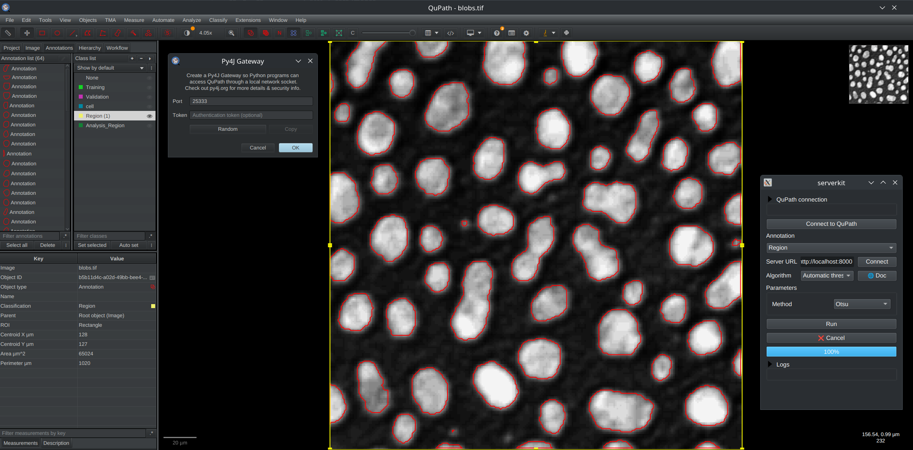

# Usage with QuPath

*Imaging Server Kit* can run algorithms on [QuPath](https://qupath.github.io/) images through [QuBaLab](https://github.com/qupath/qubalab), for segmentation and object detection tasks. Computations run inside a rectangular region defined by a QuPath annotation, and the results are directly sent back to QuPath.

!!! warning "Work in progress"
    The QuPath integration is still experimental. It also supports a narrower set of algorithms than Napari.

## Requirements

- The QuPath extra: `pip install "imaging-server-kit[qupath]"` (Python 3.11 or later).
- The [qupath-extension-py4j](https://github.com/qupath/qupath-extension-py4j) extension installed in QuPath.

## Compatible algorithms

Algorithms used from QuPath **must take exactly one `sk.Image` as input**, which is interpreted as the current QuPath image. They run on the full-resolution image, inside the region of interest. Outputs that QuPath can display include segmentation masks (`sk.Mask`, converted to polygon annotations) and bounding boxes (`sk.Boxes`).

## Connecting to an algorithm server

In this walkthrough, we will use the demo server, but any algorithm server will work.

1. Start the demo server:

    ```sh
    serverkit demo serve
    ```

2. In a QuPath project:

    - Open an image, for example `blobs.tif`.
    - Draw a rectangular annotation around a region of interest (or press `Ctrl+Shift+A` to select the whole image).
    - Assign a class to this annotation from the QuPath *Annotations* menu, for example `Region`.

3. Start a **Py4J** gateway from QuPath with the qupath-extension-py4j (you can specify a token and port if needed).

4. In another terminal, open the QuPath connection panel:

    ```sh
    serverkit qupath
    ```

    This opens a window similar to the Napari widget, with an extra section for connecting to QuPath.

5. Click *Connect to QuPath*. The *Annotation* dropdown fills with the annotation class names, such as `Region`.

6. With the server still running at http://localhost:8000, click *Connect* to list the algorithms available on the server. You can pick one and run it; the results should appear in QuPath.



You can also collect and display results in a Napari viewer (for example outputs that cannot be displayed in QuPath). For this, you can try running `serverkit qupath --with-napari`.

## Running a local algorithm

You can also open the QuPath panel to run a local algorithm, without a server, with `sk.to_qupath` (a Py4J gateway must be running in QuPath). For example:

```python
import imaging_server_kit as sk

@sk.algorithm(tileable=True)
def threshold_manual(image, threshold: float = 0.5):
    thresh_rel = threshold * (image.max() - image.min())
    mask = image > thresh_rel
    return sk.Mask(mask)

if __name__ == "__main__":
    sk.to_qupath(threshold_manual)  # <- "sk.to_qupath"
```

`sk.to_qupath` also accepts algorithm collections and clients. Use `port=` and `token=` to match the settings of the Py4J gateway, and `viewer=` to optionally spawn and collect results in a Napari viewer along with the QuPath viewer.
