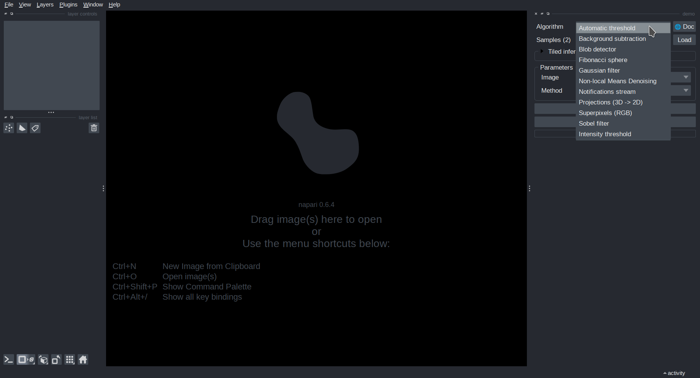
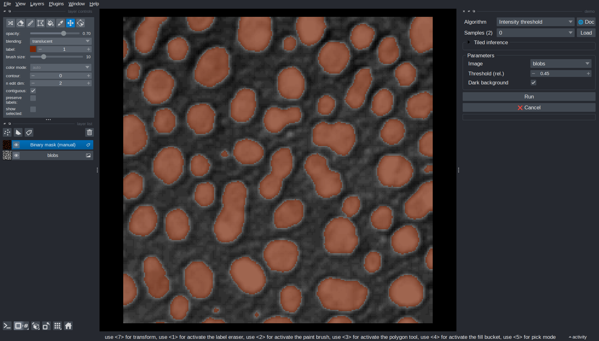
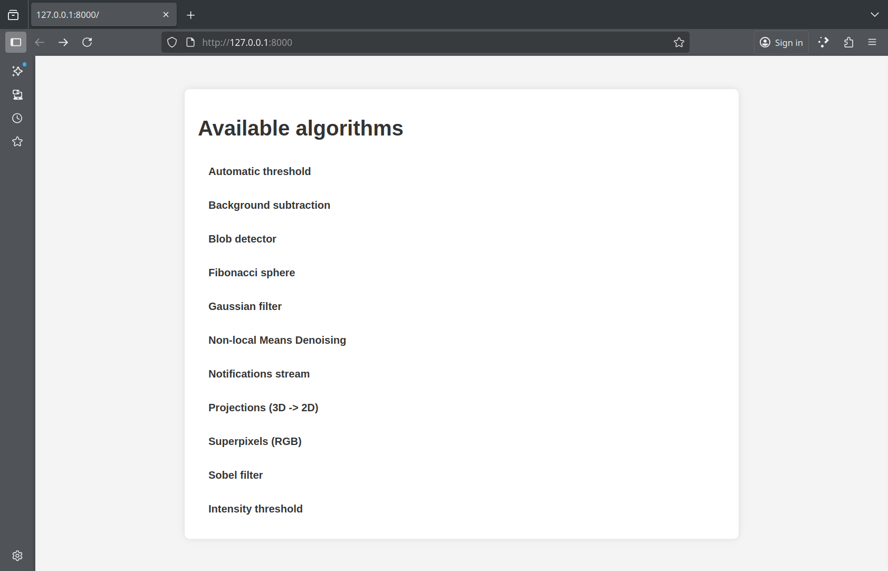
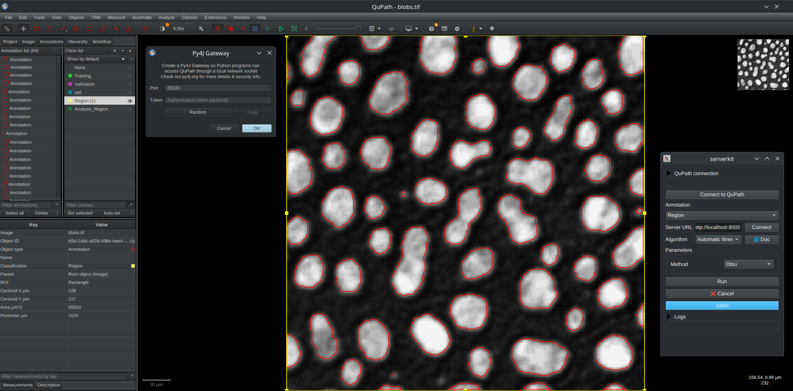

# Getting started

The following section will give you a first introduction to the Imaging Server Kit via **interactive demos**.

## Run the Napari demo

The Napari demo will give you a first idea of what the package can do. From a terminal, run:

```
serverkit demo napari
```

This command should open a **Napari viewer** with the *Imaging Server Kit* plugin already loaded. In the *Algorithm* dropdown, you will see a list of "demo" algorithms.



When you select an **algorithm**, the *Parameters* panel will update to display a list of tunable **parameters** for this algorithm.

Most algorithms require an input image. You can **load a sample image** from the *Samples* dropdown. Once you have loaded an image, you can **run** the algorithm and visualize the results in the Napari viewer.



Some algorithms automatically re-run when you change a parameters; for example, *Intensity threshold* updates the output directly when you adjust the threshold value.

```{admonition} Algo docs
You can access a **documentation page** for an algorithm in a web browser by clickin the **🌐 Doc** button. The documentation page provides a description of the algorithm as well as detailed information about its parameters. 
```

## Run the server demo

To explore how algorithms can be served over HTTP, start the local demo server:

```
serverkit demo serve
```

This launches a web server on your local machine at http://localhost:8000. If you open that page in your browser,you will see an overview of the algorithms available on the server.



### Connect from Napari

While your server is running, you can connect to it directly from Napari. Open another terminal and run:

```
napari -w imaging-server-kit
```

This is equivalent to opening the plugin in Napari from `Plugins > Imaging Server Kit > Connect to server`.

In the plugin panel, enter the server address (http://localhost:8000) and press *Connect*. The *Algorithm* dropdown will populate with the available algorithms. You can use them just like in the local case.

<video width=640 controls loop autoplay>
  <source src="../_static/server_napari.mp4" type="video/mp4">
</video>

```{note}
In this demo, both client and server run on your local machine, but keep in mind that the server could also be hosted on another machine in your local network (workstation, cluster node, raspberry pi, etc.).
```

### Connect from QuPath

You can also use Imaging Server Kit algorithms direction from QuPath via [QuBaLab](https://github.com/qupath/qubalab), for segmentation and bounding box detection tasks. To try this out, you can run the command:

```sh
serverkit qupath
```

This will bring up a user interface similar to the dock widget you used in Napari, with an extra field for connecting to QuPath via Py4J. Next, in a QuPath project:

- Open an image, for example `blobs.tif`.
- Draw a rectangular annotation in a region of interest (or use `Ctrl+Shift+A` to select the whole image).
- Assign a class to this annotation via the QuPath `Annotations` menu, for example the class `Region`.

After that, start a **Py4J** gateway from QuPath via the [qupath-extension-py4j](https://github.com/qupath/qupath-extension-py4j) (you can specify a token and port if needed). Then, click `Connect to QuPath` in the Imaging Server Kit window. The `Annotation` dropdown should now be filled with annotation class names (e.g., `Region`).

Finally, with your server still active on http://localhost:8000, click on `Connect` to discover and use the algorithms available on that server. For this demonstration, you should be able to run a simple threshold on an image in QuPath!



## Next steps

In the next section, you will learn to **create your own algorithm** in Python, so that it can be served, documented, and used in Napari just like the examples from the demo.