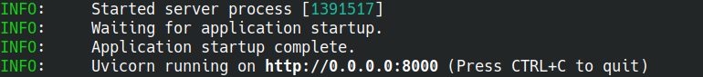

# Serving algorithms

Any Imaging Server Kit algorithm can be **served as a web API** using a built-in [FastAPI](https://fastapi.tiangolo.com/) server. This turns algorithms into web servers that you can interact with from Napari, QuPath, or Python via HTTP requests.

## Using `sk.serve`

Let's consider the threshold algorithm once again. You can serve this algorithm by passing it to `sk.serve()`. 

```python
import imaging_server_kit as sk
import skimage.data

@sk.algorithm(
    name="Intensity threshold",
    parameters={"threshold": sk.Integer(name="Threshold", min=0, max=255, default=128)},
    samples=[{"image" : skimage.data.coins()}],
)
def threshold_algo(image, threshold):
    mask = image > threshold
    return sk.Mask(mask, name="Binary mask")

if __name__ == "__main__":
    sk.serve(threshold_algo)  # <- Serve the algorithm
```

```{important}
`sk.serve()` won't work in a Jupyter notebook. You need to run the code as a **Python script**.
```

Calling `sk.serve()` starts a local FastAPI server exposing your algorithm via a set of predefined routes.



By default, the server is hosted at http://localhost:8000. If you navigate to this URL in a browser, you will see the familiar **algorithm doc** page.

Once the server is running, you can connect to it from Napari, QuPath, or directly from Python.

### Connecting from Napari

You can connect to algorithm servers from Napari via the menu `Plugins > Imaging Server Kit > Connect to server`. In the `Server URL` field, enter: http://localhost:8000, and press *Connect*. You should see your threshold algorithm listed, with all related functionalities (load samples, run algorithm, access documentation) available.

### Connecting from QuPath

You can also connect to algorithm servers and use algorithms via QuPath. From the terminal, run:

```sh
serverkit qupath
```

to bring up the QuPath connection panel. Algorithms compatible with QuPath include those that take a single image as input (interpreted as the QuPath image), and return segmentation masks or bounding boxes.

## Summary

- Use `sk.serve()` to expose any Imaging Server Kit algorithm as a FastAPI web service.
- The server runs locally at http://localhost:8000 by default.
- You can connect to algorithm servers from Napari or QuPath.

## Next steps

In the next section, we will explore how to interact with Server Kit algorithms directly from Python.