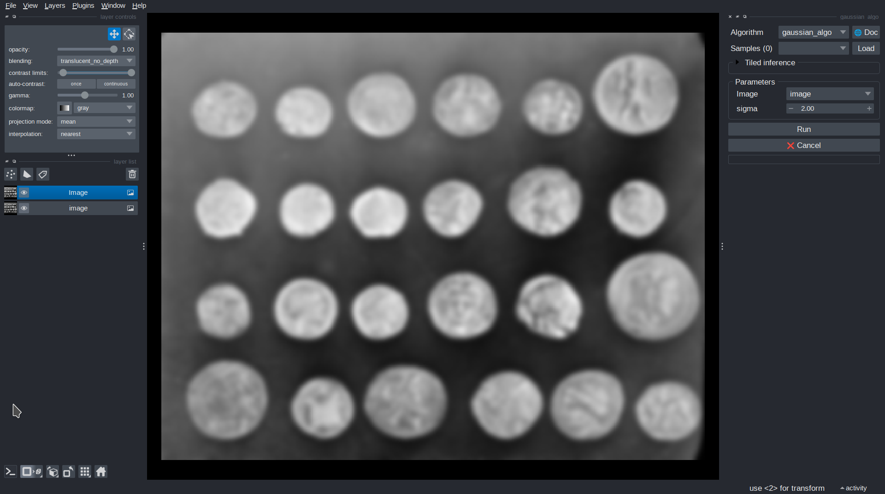

# 1. Create an algorithm

The main idea of *Imaging Server Kit* is to **convert a Python function into an algorithm**. Algorithms can then be turned into web servers, Napari widgets, and more.

This first step of the tutorial covers the basics:

- Write your image processing logic as a standard **Python function**.
- Decorate it with `@sk.algorithm`.
- Annotate **parameters** so that they are validated and displayed correctly.
- Annotate **return values** so that outputs are displayed and handled correctly.

!!! note
    The examples in this tutorial rely on Napari; install the Napari extra with: `pip install "imaging-server-kit[napari]"` if you want to run them.

## Writing a Python function

Your image processing logic should be wrapped in a Python function. For example, here is a Gaussian filter:

```python
from skimage.filters import gaussian

def gaussian_algo(image, sigma=1.0):
    filtered = gaussian(image, sigma=sigma, preserve_range=True)
    return filtered
```

This function takes an input image (a NumPy array), applies a Gaussian filter to it, and returns the filtered image. The `sigma` parameter controls the strength of the blur.

## Turning the function into an algorithm

To convert this function into an algorithm, import `imaging_server_kit` and decorate the function with `@sk.algorithm`:

```python
from skimage.filters import gaussian
import imaging_server_kit as sk

@sk.algorithm
def gaussian_algo(image, sigma=1.0):
    filtered = gaussian(image, sigma=sigma, preserve_range=True)
    return filtered
```

`gaussian_algo` is now an **algorithm** object:

```python
type(gaussian_algo)  # <class 'imaging_server_kit.core.algorithm.Algorithm'>
```

You can try it out in Napari with `sk.to_napari`, and add an example image to the viewer for testing:

```python
import skimage.data

viewer = sk.to_napari(gaussian_algo)
viewer.add_image(skimage.data.coins())
```

A Napari viewer opens with your algorithm available as a dock widget. You can apply the filter to the image and adjust `sigma` to control the blur.



The algorithm works, but there is room for improvement. For example, nothing prevents users from entering a negative `sigma`, which raises an error. To fix this, we need to **annotate parameters**.

## Annotating parameters

Annotating parameters tells *Imaging Server Kit* how to interpret the function arguments. Each parameter is matched with a [data layer](../reference/api/layers.md), which is used to validate its value and to display it in user interfaces.

Here is an improved version of the Gaussian filter, where `sigma` is annotated through `parameters={}` in the decorator, with a minimum and a default value:

```python
@sk.algorithm(parameters={"sigma": sk.Float(min=0, default=1.0)})
def gaussian_algo(image, sigma):
    filtered = gaussian(image, sigma=sigma, preserve_range=True)
    return filtered
```

In Napari, `sigma` can no longer be set to a negative value.

!!! info "Data layers"
    Data layers are a key concept of *Imaging Server Kit*. They are used to store data, describe the meaning of input parameters and algorithm outputs, and more.

    In the example above, `sk.Float` is the data layer for floating-point values. It supports options such as:

    - `min`, `max`, and `default`
    - `step` (for UI sliders and spin boxes)
    - `name` (the label shown next to the parameter)

    See [Data layers](../reference/api/layers.md) for the full list of layers.

`parameters={}` is the most explicit annotation method, but type hints, default values, and even variable names also work. All the following are valid:

```python
# Explicit annotation
@sk.algorithm(parameters={"img": sk.Image(), "sigma": sk.Float()})
def gaussian_algo(img, sigma):
    ...

# `image` variable name, default value for sigma
@sk.algorithm
def gaussian_algo(image, sigma=1.0):
    ...

# Type hints
@sk.algorithm
def gaussian_algo(img: sk.Image, sigma: float):
    ...
```

When several methods apply to the same parameter, explicit annotations take priority. See [Matching parameters with data layers](../concepts/algorithms.md#matching-parameters-with-data-layers) for a full review of the rules.

## Annotating return values

Return values should be annotated too. Thanks to this, each return value is assigned to a data layer, and is interpreted and displayed correctly in Napari or QuPath.

Consider a simple threshold algorithm:

```python
@sk.algorithm(
    name="Intensity threshold",  # <- You can also give the algorithm a name
    parameters={
        "threshold": sk.Integer(name="Threshold", min=0, max=255, default=128, auto_call=True)
    },
)
def threshold_algo(image, threshold):
    mask = image > threshold
    return sk.Mask(mask)  # <- Return the binary mask as a `sk.Mask`
```

The `threshold` parameter is restricted to values between `0` and `255`. With `auto_call=True`, the algorithm re-runs automatically whenever the threshold changes in the user interface.

The returned binary array should be interpreted as a **segmentation mask**, so it is wrapped in a `sk.Mask` data layer. In Napari, it is displayed as a `Labels` layer. In QuPath, it is automatically converted to a polygon annotation.

## Complete example

A segmentation algorithm combining a Gaussian filter and an intensity threshold could look like this:

```python
import imaging_server_kit as sk
from skimage.filters import gaussian

@sk.algorithm(
    name="Segmentation pipeline",
    description="A simple pipeline for segmenting images.",
    parameters={
        "image": sk.Image(),
        "sigma": sk.Float(
            name="Sigma",
            description="Intensity of the blur applied before thresholding the image.",
            min=0,
            default=1.0,
            step=0.5,
            auto_call=True,
        ),
        "threshold": sk.Float(
            name="Threshold (rel.)",
            description="Intensity threshold, relative to the image min() and max() values.",
            default=0.5, min=0, max=1, step=0.1,
            auto_call=True,
        ),
        "dark_background": sk.Bool(name="Dark background", default=True, auto_call=True),
    },
)
def threshold_algo(image, sigma, threshold, dark_background):
    # Apply a Gaussian filter
    blurred_image = gaussian(image, sigma=sigma, preserve_range=True)

    # Compute the absolute threshold to apply
    thresh_abs = threshold * (blurred_image.max() - blurred_image.min())

    # Binarize the image
    if dark_background:
        mask = blurred_image > thresh_abs
    else:
        mask = blurred_image <= thresh_abs

    # Compute the area fraction of the mask
    fract = mask.sum() / mask.size

    # Return all annotated outputs
    return (
        sk.Image(blurred_image, name="Blurred", colormap="viridis"),
        sk.Mask(mask, name="Binary mask"),
        f"Area fraction: {fract:.02f}",
    )

sk.to_napari(threshold_algo)
```

This algorithm:

- Produces **several outputs** of different types: `sk.Image`, `sk.Mask`, and a string. For simple types (`str`, `int`, `float`, and `bool`), wrapping the value in a data layer is optional (the layer type can be inferred). Values of unrecognized types become `sk.Any` layers.
- Includes **metadata** in its outputs. For example, `colormap="viridis"` sets the colormap of the blurred image in Napari.

## Summary

- Use `@sk.algorithm` to convert a Python function into an algorithm.
- Annotate parameters with `parameters={}`, type hints, default values, or variable names.
- Annotate return values with data layers (`sk.Mask`, `sk.Image`, `sk.Float`, etc.).
- Run algorithms interactively in Napari by passing them to `sk.to_napari()`.

## Next steps

Next, we will improve our algorithm by [adding samples and metadata](samples-and-metadata.md).
