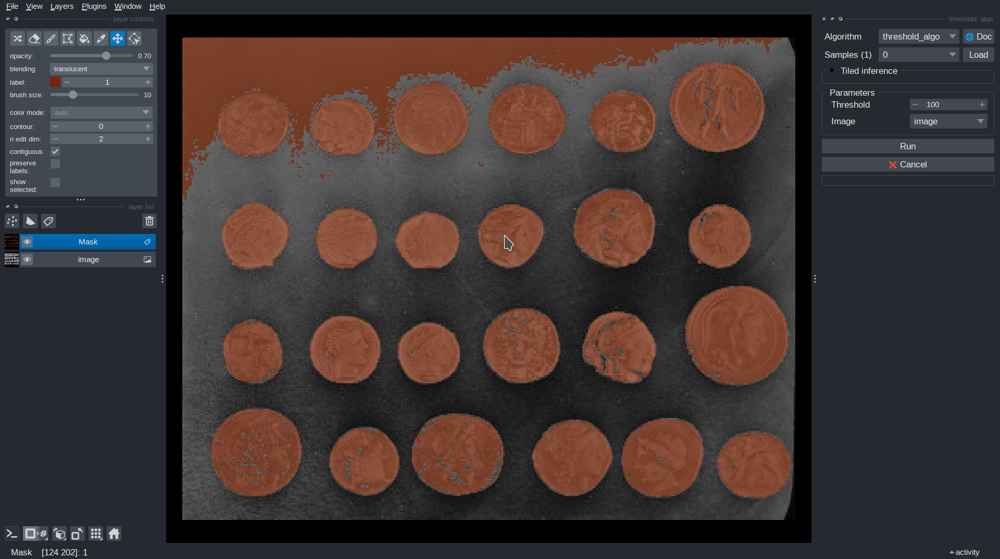
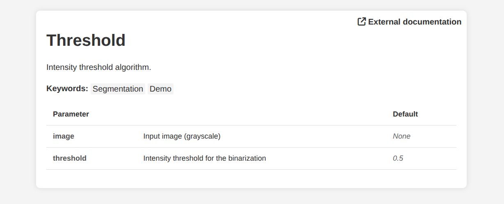

# 2. Add samples and metadata

In this step, you will add **samples** and **metadata** to the threshold algorithm from the [previous step](create-algorithm.md).

## Samples

Samples are **predefined sets of parameter values** meant to show how an algorithm can be used. They let users load an example image along with a suggested set of parameter values.

You can provide samples through the `samples=[]` argument of `@sk.algorithm`. Each entry is a dictionary mapping parameter names to values:

```python
import imaging_server_kit as sk
import skimage.data

@sk.algorithm(
    parameters={"threshold": sk.Integer(name="Threshold", min=0, max=255, default=128)},
    samples=[
        {
            "image": skimage.data.coins(),  # <- A sample image
            "threshold": 100,  # <- Threshold for that sample image
        }
    ],
)
def threshold_algo(image, threshold):
    mask = image > threshold
    return sk.Mask(mask)

# Test the algorithm in Napari
sk.to_napari(threshold_algo)
```

Here, the sample provides the `coins` image and a threshold value of `100`.

In Napari, select the sample in the *Samples* dropdown and click *Load*. This adds the example image to the viewer and sets *Threshold* to `100` in the parameters panel.



!!! note
    A sample **image** (a value for an `sk.Image` parameter) can be a NumPy array, a URL to an image hosted online, or a `Path` to a local file. URLs and paths are loaded when the sample is requested.

## Metadata

Every algorithm automatically gets a **documentation page** describing its purpose and parameters. The page is filled from **metadata** given to `@sk.algorithm`, and from the `name` and `description` of each parameter:

```python
import imaging_server_kit as sk

@sk.algorithm(
    parameters={
        "image": sk.Image(
            name="Image",
            description="Input image (grayscale)",
        ),
        "threshold": sk.Float(
            name="Threshold",
            description="Intensity threshold for the binarization",
            default=0.5,
        ),
    },
    name="Threshold",
    tags=["Segmentation", "Demo"],  # A list of tags (arbitrary)
    project_url="https://github.com/Imaging-Server-Kit/imaging-server-kit",
)
def threshold_algo(image, threshold):
    """Intensity threshold algorithm."""  # <- Displayed as the algorithm description
    mask = image > threshold
    return sk.Mask(mask)

threshold_algo.info()  # <- Open the documentation page in a web browser
```

If you don't pass a `description`, the docstring of the function is used instead.

In Napari, click the **🌐 Doc** button to open the documentation page in a web browser. Calling `.info()` on the algorithm has the same effect.



## Summary

- Use `samples=[]` to provide example parameter values, including example images.
- Sample images can be NumPy arrays, URLs, or local file paths.
- Metadata fields such as `name`, `description`, `tags`, and `project_url` fill the algorithm's documentation page.
- Open the documentation page with `.info()` or the 🌐 Doc button in Napari.

## Next steps

Next, we will [serve our algorithm](serve.md) over HTTP.
